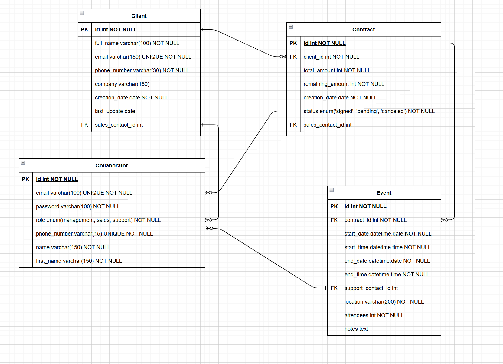
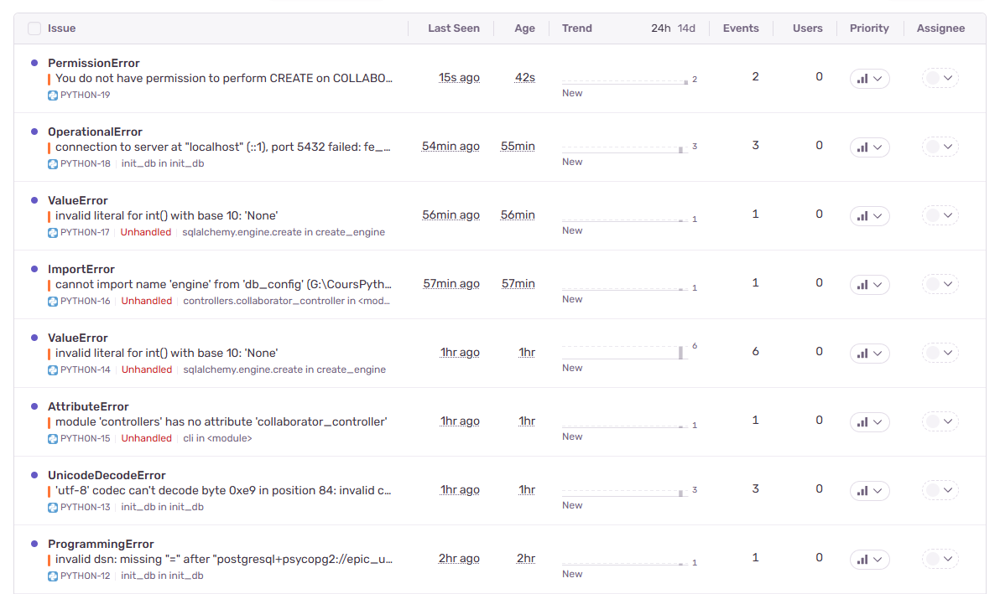

# EpicEvent

Python version 3.12.6

Poetry version 2.0.1

PostgreSQL 17


# What is it
Epic Event is a command-line interface (CLI) application developed in Python to manage clients, contracts, and events for an event organization company.

# Installation
You will need to have PostgreSQL installed on your machine.
1. Clone the repository or download an archive.
2. Open a terminal in the root of the directory
   - On Windows: right-click and select "Open in Terminal."
   - On Mac: open a terminal and drag and drop the folder directly into the terminal.
3. Install Poetry if you don't have it already: ```pip install poetry```
4. Create a virtual environment and install dependencies with: ```poetry install```
5. Activate the virtual environment with ```.venv\Scripts\activate.bat``` on Windows or ```eval $(poetry env activate)``` on macOS or Linux. (If needed, refer to: https://python-poetry.org/docs/managing-environments/#activating-the-environment)
6. Fill in the provided empty `.env` file. (see [Sentry](#Sentry) for more information about SENTRY_DSN)
7. Run the command ```epicevent init``` and follow the instructions to set up the application.

You can start using the app with the collaborator **"admin@admin.com"**, password **"Admin123!"**, it's a collaborator of type **"Management"**.
# Available Commands
Since everything is done via the command line, you will always need to start by typing ```epicevent <command_name>```.

## CLI Commands for `epicevent`

This section documents the available commands through the `epicevent` command line. Each command includes a description and an example usage.

---

### `init`
Manages the JWT secret key, creates the database, and tables.

```bash
epicevent init
```

---

### `login`
Logs the user into the application.

```bash
epicevent login
```

---

### `logout`
Logs the user out.

```bash
epicevent logout
```

---

### `create-collaborator`
Creates a new collaborator.

```bash
epicevent create-collaborator
```

---

### `update-collaborator`
Updates an existing collaborator's information.

```bash
epicevent update-collaborator
```

---

### `delete-collaborator`
Deletes an existing collaborator.

```bash
epicevent delete-collaborator
```

---

### `get-clients`
Displays all clients.

```bash
epicevent get-clients [OPTIONS]
```

**Options:**
- `--assigned` : Displays only clients assigned to the logged-in user.

---

### `create-client`
Creates a new client.

```bash
epicevent create-client
```

---

### `update-client`
Updates an existing client's information.

```bash
epicevent update-client
```

---

### `get-contracts`
Displays all contracts.

```bash
epicevent get-contracts [OPTIONS]
```

**Options:**
- `--status [signed|pending|cancelled]` : Filters contracts by status.
- `--remaining-amount` : Displays only contracts with a remaining amount.
- `--assigned` : Displays only contracts assigned to the user.

---

### `create-contract`
Creates a new contract.

```bash
epicevent create-contract
```

---

### `update-contract`
Updates an existing contract's information.

```bash
epicevent update-contract
```

---

### `get-events`
Displays all events.

```bash
epicevent get-events [OPTIONS]
```

**Options:**
- `--assign [all|assigned|no-contact]` : Filters events based on their assignment.
---

### `create-event`
Creates a new event.

```bash
epicevent create-event
```

---

### `update-event`
Updates an existing event's information.

```bash
epicevent update-event
```

# Database Schema



# Sentry
To use Sentry we have to create an [sentry account](https://sentry.io/).
Then create a new project and select plateform: Python. Follow the setup guide and look for the line dsn="https://your-key@sentry.io/your-project-id".

An example of sentry handling errors:


